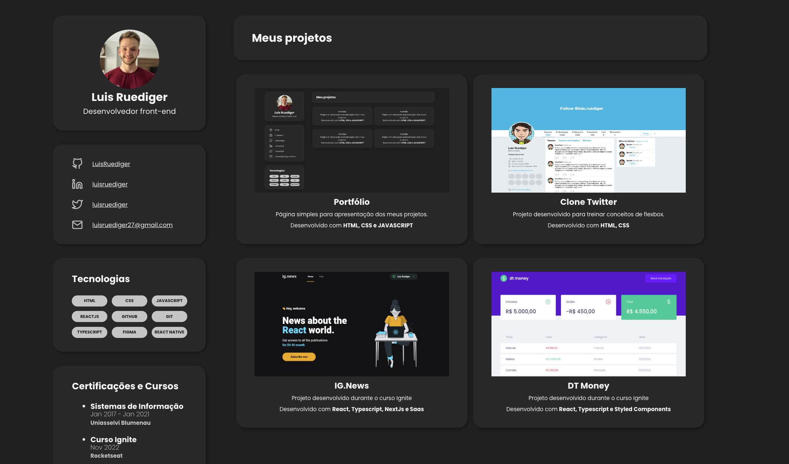

# Portfolio 

Projeto simples de portfolio  
> Para ver o projeto rodando você pode acessar este [Link](luisruediger.com.br).

---

Aplicação WEB:

  

---
## Tecnologias

- [`HTML`](https://developer.mozilla.org/en-US/docs/Web/HTML)
- [`CSS`](https://developer.mozilla.org/en-US/docs/Web/CSS)